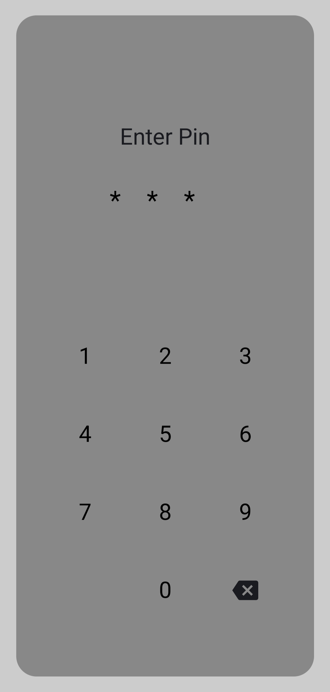
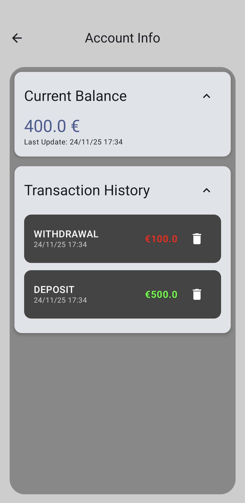
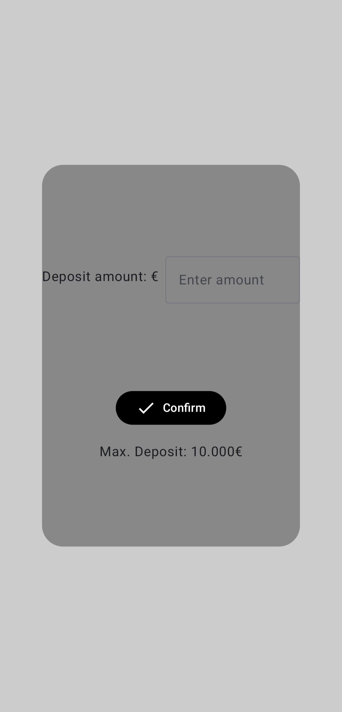

# 🏦 Simple Bank Simulation (Android/Compose)

A modern Android banking simulation application built entirely with **Kotlin** and **Jetpack Compose**. This project serves as a practical demonstration of the **MVVM (Model-View-ViewModel)** architectural pattern, enforcing clean code principles, Unidirectional Data Flow (UDF), and secure state management.

---

## 📱 Screenshots

| 🔐 PIN Screen | 💰 Account Overview | 💸 deposit |
|:---:|:---:|:---:|
|  |  |  |

---

## ✨ Features

* **🔐 Secure Authentication:** A dedicated PIN entry screen that restricts access to sensitive account data. PIN : 1234
* **📊 Real-time Dashboard:** Live view of the current account balance and user details.
* **💳 Transaction Management:**
    * **Deposits:** Add funds with input validation.
    * **Withdrawals:** Deduct funds with business logic checks (e.g., preventing overdrafts).
* **⚡ Reactive UI:** Built with Jetpack Compose, the UI automatically reacts to state changes emitted by the ViewModel.

---

## 🏗️ Architecture & Tech Stack

This project follows the recommended **Modern Android Architecture**:

* **Architecture:** MVVM (Model-View-ViewModel)
* **UI Pattern:** Unidirectional Data Flow (UDF)

### The MVVM Implementation:
1.  **Model:** Data classes representing the `Account` and `Transaction` logic.
2.  **ViewModel:** Manages the UI state using `StateFlow`. It handles business logic and exposes immutable state to the View.
3.  **View (Compose):** Stateless Composables that observe the ViewModel's state and trigger events back to the ViewModel.

### 🛠️ Tech Stack
* **Language:** [Kotlin]
* **UI Framework:** [Jetpack Compose] (Material Design 3)
* **Concurrency:** Coroutines & Flow

---

## ⚙️ Setup and Local Installation

To download and run this project on your local machine, ensure you have **Android Studio** installed.

1. **Clone the Repository:** Use the HTTPS link provided on the GitHub page.
   ```bash
   git clone https://github.com/Elarios77/Simple-Bank-Simulation
   ```

2. **Open in Android Studio:** Open the cloned directory as an existing Android Studio project.

3. **Sync Gradle:** Allow Gradle to build and sync all necessary dependencies.

4. **Run:** Build and run the application on an Android Emulator or a physical device (API 24+ is generally recommended).

**Developed by [Lazaros]**
[🔗 GitHub](https://github.com/Elarios77)
