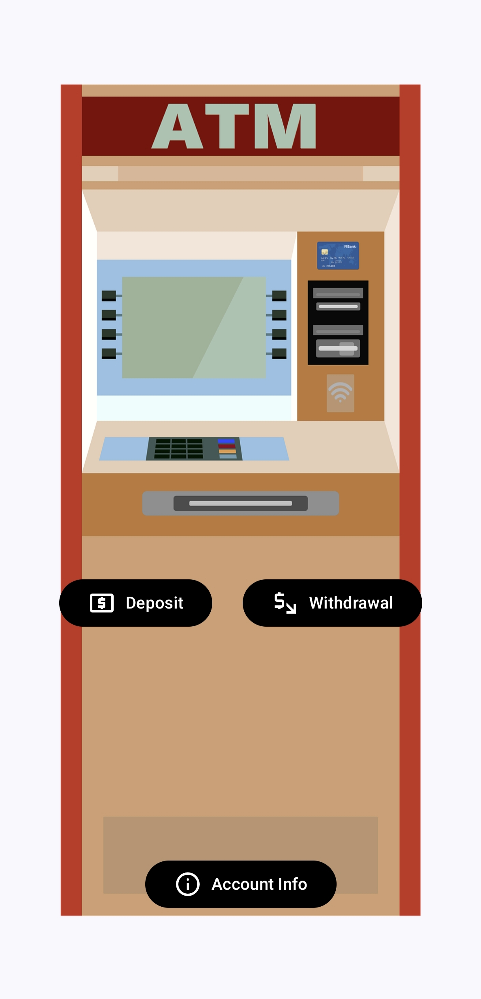

# 🏦 Simple Bank Simulation

This is a functional ATM & E-Banking simulation app developed for Android using **Kotlin**.
---

## ✨ Features & Functionality

The application simulates a complete banking workflow, implementing core logic for user authentication and transaction management:

* **User Authentication:** Requires the user to enter a correct PIN to gain access to their account. Pin: 1234
* **Main Menu:** Provides a clear navigation hub with three main options:
    * **Deposit:** Allows the user to add funds to their account balance.
    * **Withdrawal:** Allows the user to retrieve funds, checking against the current balance.
    * **View Balance & History:** Displays the current account balance and a list of the transactions (deposits/withdrawals).

---

## 🛠️ Technology Stack & Architecture

This project was developed using **Android Studio** and highlights an understanding of modern component-based design.

* **Language:** **Kotlin**
* **IDE:** Developed using **Android Studio**.
* **Core Architecture:** Implements the **MVVM (Model-View-ViewModel)** pattern.
* **Design Principle:** The structure ensures a clean **Separation of Concerns**, separating the UI logic (Views/Fragments/Activities) from the business logic and data handling (ViewModels).

---

## 📸 Screenshots

All screenshots are available in the screenshots/ directory.

| PIN/Login Screen | Main Menu |
| :---: | :---: |
|  |  |

| Account information | 
| :---: |
|  |

---

## ⚙️ Setup and Local Installation

To download and run this project on your local machine, ensure you have **Android Studio** installed.

1.  **Clone the Repository:** Use the HTTPS link provided on the GitHub page.
    ```bash
    git clone https://github.com/Elarios77/Simple-Bank-Simulation.git
    ```
2.  **Open in Android Studio:** Open the cloned directory as an existing Android Studio project.
3.  **Sync Gradle:** Allow Gradle to build and sync all necessary dependencies.
4.  **Run:** Build and run the application on an Android Emulator or a physical device.
